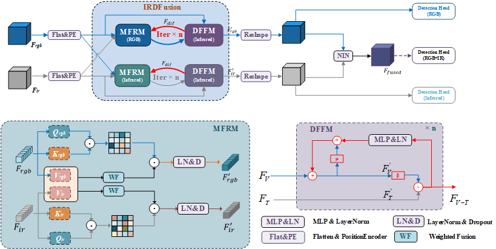

# IRDFusion: Iterative Relation-Map Difference guided Feature Fusion for Multispectral Object Detection

## Train Log    
We have provided portions of our code and training logs in the `train_log` directory. Once the paper is accepted, we will release the full code and training weights.
## Abstract
Current multispectral object detection methods often retain extraneous background or noise during feature fusion, limiting perceptual performance. To address this, we propose an innovative feature fusion framework based on cross-modal feature contrastive and screening strategy, diverging from conventional approaches. The proposed method adaptively enhances salient structures by fusing object-aware complementary cross-modal features while suppressing shared background interference. Our solution centers on two novel, specially designed modules: the Mutual Feature Refinement Module (MFRM) and the Differential Feature Feedback Module (DFFM). The MFRM enhances intra- and inter-modal feature representations by modeling their relationships, thereby improving cross-modal alignment and discriminative power. Inspired by feedback differential amplifiers, the DFFM dynamically computes inter-modal differential features as guidance signals and feeds them back to the MFRM, enabling adaptive fusion of complementary information while suppressing common-mode noise across modalities. To enable robust feature learning, the MFRM and DFFM are integrated into a unified framework, which is formally formulated as an Iterative Relation-Map Differential Guided Feature Fusion mechanism, termed IRDFusion. IRDFusion enables high-quality cross-modal fusion by progressively amplifying salient relational signals through iterative feedback, while suppressing feature noise, leading to significant performance gains. In extensive experiments on FLIR, LLVIP and M3FD datasets, IRDFusion achieves state-of-the-art performance and consistently outperforms existing methods across diverse challenging scenarios, demonstrating its robustness and effectiveness.

Paper download in [IRDFusion](https://arxiv.org/html/2509.09085v1)

## Overvire

  
  
 Fig 1. Overview of our multispectral object detection framework 

     
      
## Weights    
Weights now are available at https://drive.google.com/drive/folders/1qbRkwi48xyDfSd-rl5AA1fusx3u9SAwn?usp=drive_link

## Cite us  
@article{shen2026irdfusion,    
  title={IRDFusion: Iterative relation-map difference guided feature fusion for multispectral object detection},    
  author={Shen, Jifeng and Zhan, Haibo and Zuo, Xin and Fan, Heng and Yuan, Xiaohui and Li, Jun and Yang, Wankou},     
  journal={Pattern Recognition},     
  pages={113189},    
  year={2026},   
  publisher={Elsevier}    
}